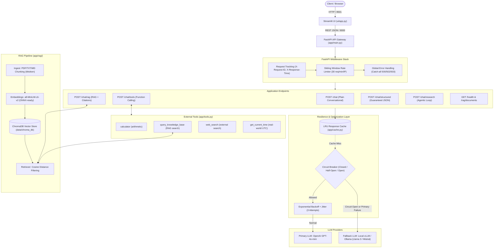
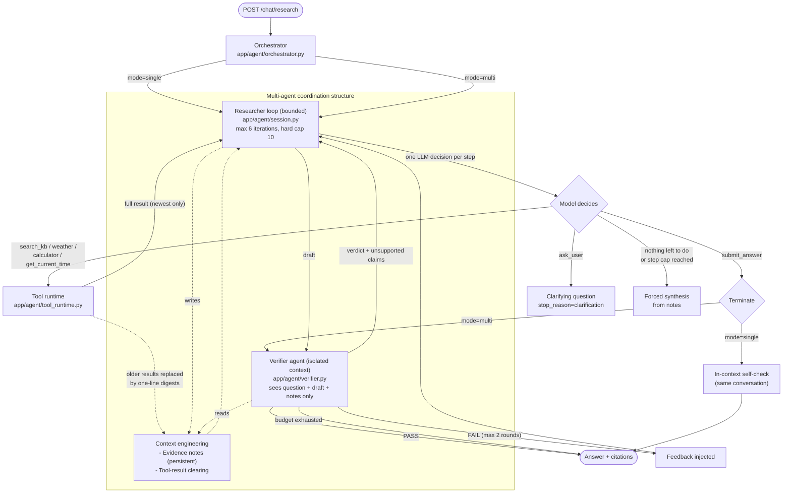

# Production-Ready AI Assistant & RAG System

[](https://fastapi.tiangolo.com)
[](https://streamlit.io)
[](https://www.trychroma.com/)
[](https://www.docker.com/)

A production-grade conversational AI assistant built with **FastAPI**, **Streamlit**, and **ChromaDB**. Features Retrieval-Augmented Generation (RAG), OpenAI function/tool calling, strict structured JSON outputs, and enterprise reliability patterns (retry with jitter, sliding-window rate limiting, circuit breaker failover, response caching, and asynchronous request processing).

**W16 Task 3 (Agentify the Assistant)** adds `POST /chat/research`: a bounded agentic loop in which the model decides, after every tool result, whether to search again, switch tools, ask the user, or answer - plus an optional independent verifier agent. See [W16 Agentic Research Loop](#w16-task-3-agentic-research-loop-agentify-the-assistant).

---

## System Architecture



### Agentic Loop Architecture (W16)



---

## Reliability & Production Engineering (Task 2)

| Pattern                          | Module                     | Details                                                                                          |
| -------------------------------- | -------------------------- | ------------------------------------------------------------------------------------------------ |
| **Exponential Backoff Retry**    | `app/llm_client.py`        | 3 attempts, randomized jitter (0.1s–0.4s) to prevent thundering herd, capped wait time.          |
| **Sliding-Window Rate Limiting** | `app/middleware.py`        | 30 requests/minute per client IP with `429 Too Many Requests` and `Retry-After` header.          |
| **Circuit Breaker**              | `app/circuit_breaker.py`   | Trips open after 5 consecutive failures, 30s recovery cooldown, probes with half-open test.      |
| **Automatic Fallback**           | `app/llm_client.py`        | Automatically routes to local vLLM or Ollama instance if primary cloud API fails.                |
| **Response Caching**             | `app/cache.py`             | Thread-safe LRU cache with TTL (256 entries, 5-minute expiry) hashing messages + parameters.     |
| **Async Execution**              | `app/main.py`              | Synchronous ChromaDB queries offloaded to thread pool (`asyncio.to_thread`) to prevent blocking. |
| **Telemetry & Observability**    | `app/middleware.py`        | Every response tagged with `X-Request-ID` and execution latency `X-Response-Time`.               |
| **Graceful Degradation**         | `app/main.py`, `ui/app.py` | Structured error models (`429`, `500`, `502`, `503`) with user-friendly alerts.                  |

---

## W16 Task 3: Agentic Research Loop (Agentify the Assistant)

**New feature:** `POST /chat/research` - *cross-source verification with self-check*. The agent
retrieves evidence, judges whether it is sufficient, and may re-search with a reworded query,
switch to another tool (`weather`, `calculator`, `get_current_time`), ask the user a clarifying
question, or answer. A draft answer is then checked (in-context self-check in `single` mode, or
by an independent verifier agent in `multi` mode) and revised if the check fails. Each run also
validates citations against the chunks actually retrieved, so an id the model never received is
dropped instead of shown as a source.

> **Why a fixed pipeline is not sufficient:** the number and order of tool calls - and whether an
> answer can be given at all - depend on what each retrieval returns, so the model must evaluate
> intermediate results after every step and change course (search again, switch tool, ask the
> user, or stop), which a pre-programmed single-pass sequence cannot express.

**Loop guarantees:** ≥ 1 LLM iteration per step (up to `max_steps`, default 6, hard cap 10),
the model picks the next action each time, and every path terminates - `submit_answer`,
`ask_user`, or forced synthesis from the notes when the step budget is exhausted.
`mode=single` (one agent, in-context self-check) and `mode=multi` (researcher + verifier) share
the same loop; only the check differs.

### a. Context Engineering Technique

**Structured external notes + tool-result clearing** (with capped retrieval as a secondary measure).

- **Where:** `app/agent/notes.py` - the `EVIDENCE NOTES` block is a system message kept at index 1
  of the conversation and rewritten after every step; `_clear_old_tool_results()` in
  `app/agent/session.py` rewrites *every tool message except the newest* to a one-line
  `[cleared] search_kb("...") -> 4 chunks: python.pdf#<id>, ...` digest.
- **Problem it solves:** one `search_kb` result is up to 4 chunks x 700 chars (~2.8 KB). Six steps
  of raw results would push ~17 KB of retrieved text into every later request, crowding out the
  system prompt and decisions (context saturation) - and the model would have to re-read stale
  evidence to find one chunk id. With clearing, only the newest result stays at full size, while
  the distilled facts (chunk ids, 140-char snippets, tool errors, weather/calculator results)
  persist in a notes block capped at 6 entries. This is what lets the loop re-search 6 times
  without the context growing linearly, and it is also what the verifier receives instead of the
  research transcript.

### b. Agentic Pattern

**Multi-agent system** (with a single-agent baseline in the same codebase).

`mode=multi` runs a *researcher* agent (iterative tool loop) and a *verifier* agent that gets an
**isolated context**: only the question, the draft and the notes - never the research transcript.
The choice maps to two class benefits: **context isolation** (the verifier cannot be anchored by
the researcher's reasoning, which is exactly the *self-verification paradox* the single agent
suffers from - its self-check re-reads its own conversation) and **specialization** (exploration
and claim-evidence matching are different jobs with different prompts and temperature 0).
Against the five structural failures: context saturation is handled by the technique above;
the *sequential bottleneck* of a serial verification step is accepted but bounded (max 2 rounds);
the *single point of failure* of the verifier is covered - unparseable verifier output returns
`SKIPPED` and the answer is accepted rather than looping. The single-agent mode is kept because
for simple queries the coordination cost is not worth it: measured on 13 queries it used 33%
fewer tokens (see below). Single-agent is the better fit when verification is cheap and the
context is short.

### c. Evaluation Harness

`eval/harness.py` + `eval/queries.json`, written from scratch (stdlib HTTP, own graders, own
report generator - no evaluation framework). It drives the real HTTP endpoint for 13 queries x
2 modes (26 runs), covering KB facts, cross-source comparison, cross-tool chains, tool-only
queries, unanswerable/irrelevant topics, an ambiguous query needing clarification, and 3
failure-injection runs per mode.

Measured per run: **task completion** (declarative criteria per query), **tool-call correctness**
(expected tool selected + every tool call has a non-empty, well-typed argument, including
citation chunk ids of realistic shape), **trajectory length** (LLM iterations, step-cap hits),
**tokens** (from the API `usage` field of every call in the loop, researcher + verifier) and a
**failure log** classified with the class taxonomy: *hard* (task not completed), *soft*
(completed but degraded - too few searches, rejected citation, forced synthesis at the cap),
*cascading soft* (a tool call failed during the run and the final output is still defective).
Grader rules are printed in the report so every PASS/FAIL is reproducible.

Results (full report: [`eval/results/report.md`](eval/results/report.md)):

| metric | single | multi |
|---|---|---|
| Task completion | 12/13 (92.3%) | 12/13 (92.3%) |
| Tool-call correctness (expected tool / valid args) | 100% / 100% | 100% / 100% |
| Mean trajectory (iterations) | 2.38 | 3.31 |
| Total tokens (13 queries) | 56,134 | 74,843 |
| Failures | 1 hard | 1 hard, 1 soft, 1 cascading soft |

The one hard failure in both modes is real and logged: `kb_compare_lists_vs_tuples` answered
correctly but omitted citations despite the query asking for them. Re-run with
`python3 eval/harness.py --modes single,multi`.

### Additional Requirements

**1. Skill vs. Agent.** The capability could have been a Skill (a `SKILL.md` loaded on demand that
tells the model "search, check, then answer"); it was built as a loop with tools instead because
the feature is defined by *stateful control flow driven by tool feedback* - retry with a reworded
query, switch tools, stop at a step cap, reject citations outside a whitelist - and those are
code-enforced guarantees (loop bound, citation validation) that a document loaded into context
can only request, not enforce.

**2. Token and cost accounting.** The harness sums `prompt/completion/total` across every LLM call
of a request (researcher iterations, self-check or verifier rounds) and reports per query.
Multi-agent costs **74,843 vs 56,134 tokens (+33.3%)**, 58 vs 41 LLM calls and +0.93 mean steps:
the coordination cost is the verifier re-sending question + draft + notes in a fresh context each
round (the price of isolation) plus the extra research rounds triggered by failed verdicts.
Isolation is not pure overhead - the verifier sees a far smaller context than the researcher's
full transcript, which is why the gap stays in the low tens of percent rather than doubling.

**3. Failure injection.** `ResearchRequest.inject_failure` (`kb_down` | `malformed_retrieval` |
`timeout`) makes `search_kb` return an HTTP-503-style error, a corrupt non-list payload, or a
timeout in `app/agent/tool_runtime.py`. Result: **6/6 runs answered honestly - 0 fabricated
citations, 0 sources claimed**. With `kb_down` the agent explicitly said *"I am currently unable
to access the knowledge base..."*; under `malformed_retrieval`/`timeout` it more often asked a
clarifying question instead of naming the broken tool - honest (nothing was invented) but it
masks the root cause, which is why those runs still surface `tool_errors` in the response and are
classified in the failure log (the `kb_down` multi run, which also burned its step budget
retrying, is logged as a cascading soft failure).

**4. Tool vs. agent boundary.** The weather capability wraps Open-Meteo, an external service that
is itself two-step (geocoding then forecast) and stateless; it is modeled as a **bounded tool
call** - one invocation, two HTTP requests, an 8-second timeout, and errors returned to the model
as tool results - rather than an agent-to-agent interaction, because the service has no
independent goal, no memory and no judgment to isolate: handing it to an agent would only add
coordination tokens. The verifier is agent-to-agent for the opposite reason - it owns its own
context and a judgment that must not share the researcher's.

---

## Quick Start Guide

### Prerequisites

- [Docker](https://docs.docker.com/get-docker/) & [Docker Compose](https://docs.docker.com/compose/)
- An OpenAI API Key (or local vLLM / Ollama instance)

### 1. Environment Configuration

Copy `.env.example` to `.env`:

```bash
cp .env.example .env
```

Set your OpenAI API Key in `.env`:

```ini
LLM_PROVIDER=openai
OPENAI_API_KEY=sk-your-key-here
OPENAI_MODEL=gpt-4o-mini
```

### 2. Launch Stack with Docker Compose

```bash
# Option A: Standard stack (FastAPI Backend + Streamlit UI)
docker compose up --build -d

# Option B: Full stack with local Ollama fallback
docker compose --profile ollama up --build -d

# Option C: Full stack with local vLLM serving Llama 3
docker compose --profile vllm up --build -d
```

### 3. Access Application Services

- **Web UI:** [http://localhost:8501](http://localhost:8501)
- **API Documentation (Swagger):** [http://localhost:8000/docs](http://localhost:8000/docs)
- **Health Check & Telemetry:** [http://localhost:8000/health](http://localhost:8000/health)

---

## Local Development (Without Docker)

```bash
# 1. Create and activate virtual environment
python3 -m venv myenv
source myenv/bin/activate

# 2. Install dependencies
pip install -r requirements.txt
pip install -r requirements-ui.txt

# 3. Start backend
uvicorn app.main:app --host 0.0.0.0 --port 8000 --reload

# 4. Start UI (separate shell)
BACKEND_URL=http://localhost:8000 streamlit run ui/app.py
```

---

## REST API Specification

### `POST /chat`

Plain conversational chat with tunable parameters.

```json
// Request Body
{
  "message": "Explain recursion in one paragraph",
  "temperature": 0.2,
  "top_p": 1.0,
  "max_tokens": 500
}
```

### `POST /chat/tools`

Function-calling endpoint capable of invoking `calculator`, `query_knowledge_base`, `web_search`, and `get_current_time`.

```json
// Request Body
{
  "message": "Calculate sqrt(144) * 5 and tell me what documents are in the knowledge base."
}
```

### `POST /chat/rag`

Retrieval-augmented generation. Queries ChromaDB, retrieves relevant chunks, formats context, and returns answer with source citations and confidence rating.

```json
// Response Body
{
  "answer": "A decorator in Python is a callable that takes another function as an argument...",
  "sources": [{ "document": "python.pdf", "chunk_id": "7b8f9e..." }],
  "confidence": 0.95
}
```

### `POST /chat/structured`

Produces strict JSON output guaranteed to follow the `AssistantAnswer` schema.

### `POST /chat/research`

Agentic research loop (see [W16 Task 3](#w16-task-3-agentic-research-loop-agentify-the-assistant)).

```json
// Request Body
{
  "query": "Compare lists and tuples, cite your sources",
  "mode": "multi",
  "max_steps": 6,
  "inject_failure": "kb_down"
}
// Response Body
{
  "answer": "Lists are mutable ...",
  "sources": [{ "document": "python.pdf", "chunk_id": "7b8f9e..." }],
  "stop_reason": "submitted",           // submitted | max_steps | clarification
  "steps": 3,
  "trajectory": ["search_kb:ok", "submit_answer:accepted"],
  "verification": { "verdict": "PASS", "rounds": 1 },   // multi mode only
  "tokens": { "prompt": 4513, "completion": 511, "total": 5024 },
  "tool_errors": []
}
```

### `GET /health`

Returns operational health, circuit breaker state, cache statistics, and ingestion status.

### `GET /rag/documents`

Lists distinct indexed documents in ChromaDB with chunk counts.

---

## Model Optimization & ONNX (Task 2)

See [`ONNX.md`](ONNX.md) for full technical analysis:

- **Hosted Cloud LLMs**: Closed-source API models cannot be exported to ONNX because model weights and graph definitions are proprietary.
- **Local LLMs**: Serving engines like **vLLM** (PagedAttention) and **Ollama** (GGUF SIMD assembly kernels) drastically outperform ONNX Runtime for autoregressive token decoding.
- **RAG Embeddings (ONNX Applicable)**: The sentence-transformers embedding model (`all-MiniLM-L6-v2`) is an encoder model with a static graph. Exporting to ONNX delivers **2.5× to 3.0× CPU speedup**.
- Export utility script provided in `app/rag/onnx_export.py`.

---

## Cloud Deployment Guide

### 1. Azure Container Apps

```bash
az containerapp up \
  --name ai-assistant-backend \
  --resource-group rg-ai-systems \
  --image <acr_registry>.azurecr.io/ai-assistant-backend:latest \
  --target-port 8000 \
  --ingress external \
  --env-vars "OPENAI_API_KEY=<key>" "LLM_PROVIDER=openai"
```

### 2. AWS ECS Fargate

1. Push Docker image to Amazon ECR.
2. Create Task Definition specifying 1 vCPU and 2 GB RAM.
3. Configure Application Load Balancer (ALB) targeting container port 8000.
4. Set secrets (`OPENAI_API_KEY`) via AWS Secrets Manager.

### 3. Google Cloud Run

```bash
gcloud run deploy ai-assistant-backend \
  --image gcr.io/<project-id>/ai-assistant-backend:latest \
  --platform managed \
  --region us-central1 \
  --port 8000 \
  --set-env-vars "OPENAI_API_KEY=<key>,LLM_PROVIDER=openai" \
  --allow-unauthenticated
```

---

## Automated Testing Suite

Run the comprehensive unit and integration test suite (39 tests, including 14 deterministic
agent-loop tests in `tests/test_agent.py` that drive the loop with a fake LLM):

```bash
PYTHONPATH=. ./myenv/bin/python -m unittest discover -s tests -p "test_*.py" -v
```

## Evaluation Harness (W16)

```bash
# with the stack running (docker compose up -d)
python3 eval/harness.py --base-url http://localhost:8000 --modes single,multi
# writes eval/results/results.json and eval/results/report.md
```
